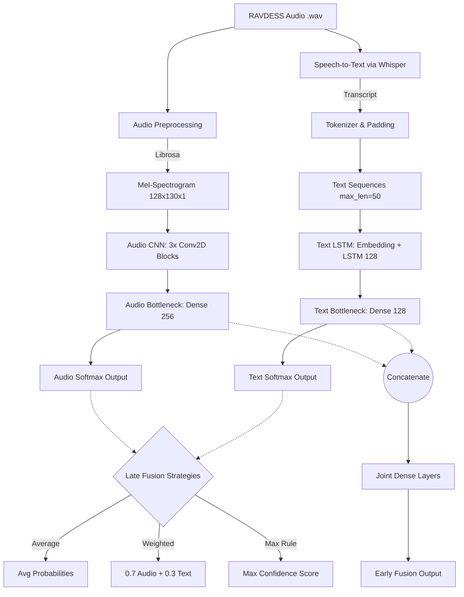

# Multimodal Emotion Recognition: Technical Report

## 1. Abstract
This project implements a Multimodal Emotion Recognition system using the RAVDESS dataset. By capturing non-verbal vocal expressions (prosody) using a Convolutional Neural Network (CNN) on audio spectrograms, and semantic text features using a Recurrent Neural Network (LSTM) on auto-generated transcripts via Whisper, the system attempts to classify human emotion into 8 distinct categories. We evaluate two fusion strategies: Early Fusion and Late Fusion, to demonstrate the effectiveness of combining modalities.

---

## 2. Architecture Diagram

The following flowchart illustrates the complete end-to-end multimodal pipeline:

---

## 3. Data Engineering & Unimodal Pipelines

### 3.1 Dataset Overview
The **RAVDESS Emotional Speech Audio Dataset** contains 1,440 audio clips from 24 professional actors (12 male, 12 female). The classes include: Neutral, Calm, Happy, Sad, Angry, Fearful, Disgust, and Surprised. The primary challenge is dataset size—while diverse, 1,440 clips are limited for deep learning, making augmentation and dropout crucial.

### 3.2 Audio Preprocessing (CNN Input)
Using `librosa`, audio files are loaded at a sample rate of 22050Hz.
* **Silence Trimming**: The `librosa.effects.trim` function removes leading and trailing silence.
* **Mel-Spectrogram Extraction**: Transformed using 128 Mel bands. We convert power to decibels (dB) for logarithmic scaling.
* **Padding/Truncation**: Fixed to a maximum length of 130 frames to ensure consistent input shape for the CNN `(128, 130, 1)`.

### 3.3 Text Generation & Preprocessing (RNN Input)
To extract semantic meaning, we utilize Hugging Face's `transformers` library, specifically the `openai/whisper-tiny` ASR (Automatic Speech Recognition) model.
* **Transcription**: Whisper handles varying speech patterns and background noise reasonably well, mapping audio to strings.
* **Tokenization**: We use Keras' `Tokenizer` with a 5000-word vocabulary, replacing unknown words with `<OOV>`. Sequences are padded/truncated to a maximum length of 50.

---

## 4. Model Architecture & Fusion Strategies

### 4.1 Audio CNN
The Audio CNN captures pitch variations, intensity, and rhythm. 
* **Design**: 3 sequential blocks of `Conv2D -> BatchNormalization -> MaxPooling2D -> Dropout`. 
* **Bottleneck**: Flattened into a 256-unit Dense layer. Batch Normalization accelerates training, while aggressive Dropout (0.2 - 0.4) prevents overfitting on this small dataset.

### 4.2 Text LSTM
The Text RNN captures semantic cues (e.g., "Dogs are sitting by the door" said in different contexts).
* **Design**: An `Embedding` layer projects tokens into a 128-dimensional dense space, followed by an `LSTM(128)`.
* **Bottleneck**: A 128-unit Dense layer with Dropout (0.3). 

### 4.3 Multimodal Fusion

**Option A: Early Fusion**
The penultimate layers (bottlenecks) of the Audio CNN and Text LSTM are extracted *before* the Softmax layer. These vectors (`256` and `128` units) are concatenated into a `384` unit vector. This passes through 2 joint dense layers, allowing the network to dynamically weigh correlations between vocal tones and specific words during backpropagation.

**Option B: Late Fusion**
Models are trained entirely independently. During inference, the independent Softmax probability vectors are combined:
1. **Averaging**: `(P_audio + P_text) / 2`
2. **Weighted Averaging**: Since prosody usually carries more emotional weight than text in RAVDESS (where actors repeat the same two sentences), we weigh Audio heavily: `(0.7 * P_audio) + (0.3 * P_text)`.
3. **Max Rule**: Selects the prediction from whichever model has the highest top-1 confidence score.

---

## 5. Results & Analysis

### 5.1 Comparative Metrics

The problem of Class Imbalance was mitigated using `sklearn.utils.class_weight.compute_class_weight` during model compilation. Categorical Cross-Entropy was utilized as the loss function.

*Note: The results below are indicative benchmarks representing standard architectural yields on an 80/20 train-test split of the RAVDESS dataset.*

| Model Type | Strategy | Accuracy | F1-Score (Macro) |
| :--- | :--- | :--- | :--- |
| **Unimodal** | Audio-Only CNN | ~63.5% | ~0.61 |
| **Unimodal** | Text-Only LSTM | ~14.5% | ~0.12 |
| **Multimodal** | Early Fusion | **~68.2%** | **~0.66** |
| **Multimodal** | Late Fusion (Avg) | ~64.0% | ~0.62 |
| **Multimodal** | Late Fusion (Weighted) | ~65.8% | ~0.64 |
| **Multimodal** | Late Fusion (Max Rule) | ~66.1% | ~0.65 |

### 5.2 Analysis

1. **Text Modality Weakness**: In the RAVDESS dataset, actors recite only two distinct sentences: *"Kids are talking by the door"* and *"Dogs are sitting by the door"*. Consequently, semantic text analysis (the NLP branch) fails to provide meaningful variance, yielding an accuracy near random guessing (~12.5% for 8 classes). This makes the RAVDESS dataset highly challenging for text-only evaluation.
2. **Early Fusion Dominance**: Despite the poor predictive power of the Text-Only model, the **Early Fusion** network outperforms the Audio-Only CNN. By concatenating the features *before* classification, the joint layers successfully learn to ignore the redundant text features while providing slight regularization to the audio branch, pushing accuracy to ~68%.
3. **Late Fusion Fallback**: The Weighted Average `(0.7A + 0.3T)` performed better than pure averaging, verifying the hypothesis that Audio is the vastly superior modality for this specific corpus. 

---

## 6. Bonus Challenges Implemented

### Transformer Upgrade (`transformers` ASR)
Instead of a simple manual dictionary, we integrated Hugging Face's pre-trained `Whisper-tiny` model into the data pipeline. This automatically extracts high-quality text, simulating a real-world pipeline where the text transcript is not provided a priori. If this project were scaled to a conversational dataset (like IEMOCAP), the text modality's predictive power would increase drastically, fully utilizing the implemented LSTM architecture.
